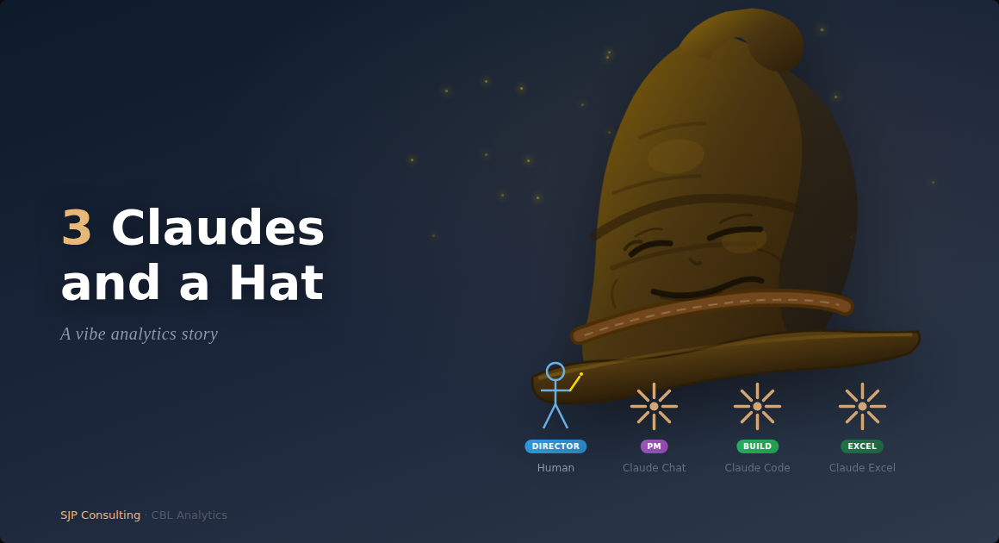

Last week I built and debugged an Excel financial model with the help of 3 different Claudes, without writing a line of code or any Excel formulas. It felt good.

### The Setup

I'm building [CBL Analytics](https://www.cblanalytics.com/), an AI powered 'Assistant Corporate Analyst' app that: 

- extracts SEC EDGAR filings  (10-K, 10-Q, 20-F) with related web search data into a knowledge base and synthesises information into comprehensive financial and risk reporting package using multi-agent AI tools (using OpenAI Agents SDK and examples).
- enables semantic/sql search of the ChromaDB/SQLite KB for ad hoc queries (also web search augmented).
- does a 3-statement Excel-based DCF forecast analysis, with user defined assumptions, to share-price level.
- does python/R based sensitivity, scenario and simulation analyses.
- outputs to a Markdown document, for user completion (Quarto).

It's more of an exploratory 'can' we do it exercise rather than a 'should' we do it exercise, but it is very interesting. We are still building it out a bit more, so I will expand on the full workflow in a later note.

### The Situation

The way I have been working on the app and the rest of the workflow is a sort of **vibe analytics** approach which, to me, means I do not actually code or write Excel formulas. Rather, I 'orchestrate', which really just means I talk to my AI friend a lot - Claude in my case. 

But not just the one Claude - I use different types of Claudes for different roles (and that is all before having multiple instances of the same Claude running concurrently, very infrequently). I know a single Claude can wear multiple Hats, but I choose to do it this way.

### The Cast

- **Human** - Project Director (?) and functional approver and reviewer - tends to be the bottleneck in the process.
- **Claude Chat** - Project Manager and technical approver and reviewer - prepares implementation plans, first draft technical specs, instructions and prompts. Claude Chat can have multiple ongoing projects, which helps with organisation.
- **Claude Code CLI** - Builder, but reviews/improves detailed code before implementation
- **Claude in Excel** - Hired more recently to do the Excel model development
- **The Hat** - actually a four hat workflow - Planner, Approver, Builder, Reviewer.

### How It Unfolded

The app is finished (at least to a basic MVP stage), so we decided to press forward into the Excel model development stage (I have done many, many financial models over the years so keen to see how AI copes). 

After evaluating options, we went with Claude for Excel to build the Excel model. Claude for Excel is still quite limited though - cannot do VBA (well cannot access the modules), tables, data tables, named ranges and a whole collection of other things which Claude in Excel will happily admit to if you ask. 

Nevertheless we went ahead with this approach, as we were seeing what we could do not what we should do, and there were other issues with Python in Excel etc. 

The other issue is that the other Claudes can't seem to see or access Claude for Excel, so it was left to Human to run the dialogue with Claude for Excel.

Anyway, we chatted, and Claude Code CLI then built a download file (a 'Data Contract'), which suited Claude in Excel's requirements. 

Claude in Excel and I had many discussions to build the model, and we got it fairly quickly finished enough to want to validate what we had. 

So we decided to do a  QA, and I outsourced that to Claude Chat - Claude Chat can read spreadsheets of course. The trouble is that Claude for Excel can't seem to read the MD output from the other Claudes, so you either cut/paste into the spreadsheet dialogue box or into a worksheet tab. But it all works, if a little clunky.

### The Teamwork

So with the QA:

- **Claude Chat** found a range of issues in the spreadsheet, which we expected to happen given the model was still in development.
- We fed review back to **Claude for Excel** (in a worksheet tab)
- **Claude for Excel** thanked us for our input, added the issues to the 'roadmap' we had and fixed most. A couple however were to do with the download from the app, which **Claude Code CLI** had built based on instructions from **Claude Chat** and using the 4 **Hat** workflow approach
- So **Claude in Excel** drafted a fix to the download spec, which **Human** dutifully passed on to **Claude Chat**.
- **Claude Chat** worked with **Human** and **Claude Code CLI** using the 4 **Hat** approach to make and test the fix, which was then committed and pushed.
- On successful deployment an updated example (AAPL in this case) was downloaded for **Claude in Excel** to review.
- **Claude in Excel** approved the fix, so mission accomplished

It sounds like a long process, but it actually was just quite quick. I do however recognise a process review might be warranted. Might even be a job for OpenClaw, if i ever learn to trust it...

### What Made This Work

1. **Separation of concerns** - Each Claude operated in its domain of expertise
2. **Structured handoffs** - Bug reports and implementation specs, not vague requests
3. **Human as orchestrator** - I approved transitions between phases, not individual lines of code
4. **The Four Hats** - Planner → Approver → Builder → Reviewer, even when the "hats" are worn by different AIs

### The Takeaway

We talk about AI agents collaborating, but this was three separate Claude instances - no shared memory, no orchestration framework - just structured communication through a human coordinator.

The bug was found by an AI chat, agreed to by an AI in a spreadsheet, scoped by an AI in a chat, validated against production data by an AI in a terminal, and verified by the AI in the spreadsheet.

Also, AI does not get everything right all the time .. not even. The normal checks and balances which have always been required are still necessary, obviously.

Is this "vibe analytics"? Maybe, I just like the name. But it felt more like conducting an orchestra where every musician is really good at playing their parts, and the conductor can at least hang in there.

*Steve Parton is a finance and analytics consultant building AI-powered financial analysis tools at SJP Consulting. CBL Analytics transforms SEC filings into actionable intelligence.*
