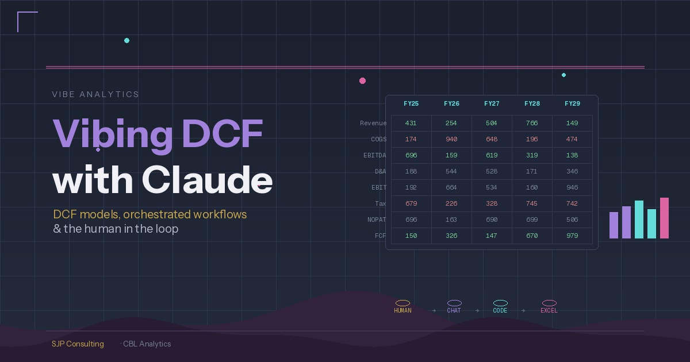

**What does it look like when you treat Claude not as a tool but as a team? Here's how I'm building 3-way DCF valuation models without writing a line of code or a single Excel formula.**

I have been working with various Claudes in the financial analytics space since last October now, and it continues to get better — and I am gradually getting better as well!

In my [last post](../2026-02-04-Three-Claudes-and-Hat/index.qmd) I described the team: Claude Chat as project manager, Claude Code CLI as builder, and Claude in Excel for spreadsheet work — three separate Claude instances, no shared memory, coordinated through a human orchestrator. Here's how that process has matured, specifically around building DCF valuation models.

### The Approach

I use Claude Chat in Claude Desktop as my 'Project Manager' on a range of projects, but in this case to produce 3-way DCF valuation models. The coding is done in Python (and I am not a good Python coder) in VSCode using Claude Code CLI (who is a very good Python coder, particularly with Opus 4.6). The code produces a completed spreadsheet, which appears as just a normal DCF model like any other. The difference is that all formulae were written by Claude Code and all starting input assumptions were populated by Claude Code. No human intervention in the spreadsheet at all until it is fully written. The human involvement happens up front, in planning discussions with Claude Chat.

This suits my use case because the Python code is then effectively a template, which I can re-use either as-is or with whatever modifications are required for other models. As I have been looking at companies in an oligopoly it is useful to analyse all members of the oligopoly, and given they tend to be similar in construct, having a template model is very useful.

For additional tailoring I can also use Claude in Excel. And if I had wanted to just write the model in Excel without the Python part, I could have used Claude in Excel directly, although I have found it a little troublesome — it is still very new.

As we all know though, AI can hallucinate, so comprehensive QA is still required. Here is how I approach that.

### Planning

I generally have a conversation with Claude Chat initially to sketch out the project. Claude Chat is good for this as it includes the concept of projects, so that — together with my Obsidian vaults — helps to keep the project organised.

I will then get Claude Chat to prepare a staged implementation plan, which I can review and we can refine together. I like staging the implementation, as a couple of times Claude Code CLI has gone rogue, causing rather material regressions (thankfully git came to the rescue). The initial planning is essential, but like all plans, adjustments can always be made.

### Implementation

I will then get Claude Chat to prepare the required prompts and instructions for Claude Code CLI, generally stage by stage. All these documents are saved within the project, which both Claude Chat and Claude Code CLI have access to. So even though they do not communicate directly, communication between the two is not an issue.

Claude Code CLI then writes the Python code after first reading the prompt and reviewing Claude Chat's instructions, flagging issues and suggestions. This is not so important with new builds, but it is great in existing projects as Claude Code CLI will often pick up issues, being a lot closer to the codebase than Claude Chat.

Claude Code CLI will stop for approval at the end of each stage and wait for sign-off from Claude Chat (for coding issues) and me (for functional issues). When we approve the changes they are then committed to git.

### QA

QA is done separately on the Python code and the completed spreadsheet. I generally get Claude Chat to handle this, consisting of:

- A review of the whole codebase for any issues — whether architectural, syntax, or other technical issues. I have used other models (for example Gemini) for this which can also be useful.

- A spreadsheet audit, reviewing the integrity of the spreadsheet and adherence to best practices.

- A spreadsheet validation, reviewing assumptions against sources (Claude has access to both). All assumptions can be changed by the user anyway, but this is still a good initial step.

This might sound like a long process, but Claude is quick — the bottleneck is the human in the loop and I prefer to retain more control through the process, for the moment, so Claude just has to wait.

### Next Steps

I am going to try and push the Python side of the process further, using the spreadsheet as a final report and validation mechanism for users and auditors, but pushing more advanced analytics into the Python side — then dropping outcomes back into the spreadsheet, and/or straight into a final PDF, Markdown, or HTML report.

*Steve Parton is a finance and analytics consultant building AI-powered financial analysis tools at SJP Consulting. CBL Analytics transforms SEC filings into actionable intelligence.*
