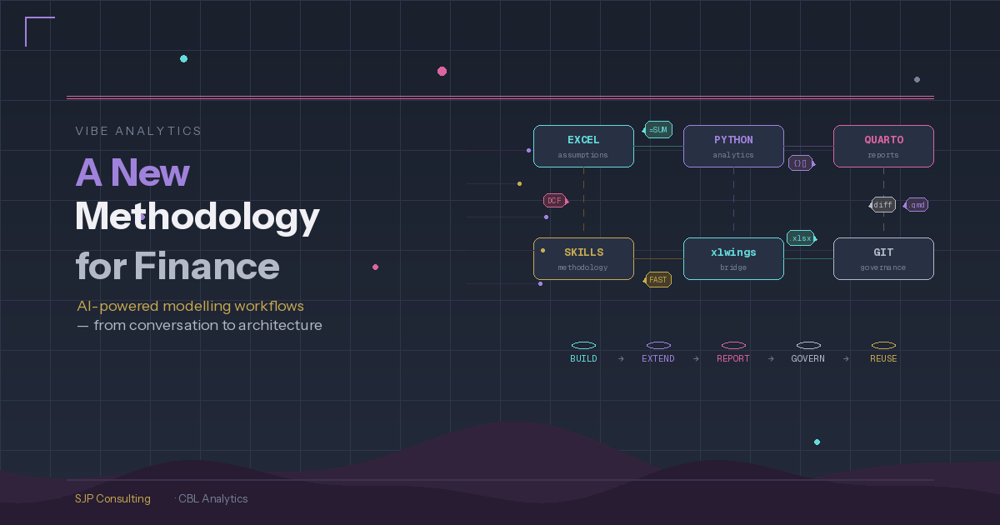

I've spent 30+ years building financial models in Excel. The toolset available to finance professionals right now is extraordinary — and changing fast. This post is about how to make best use of what now exists, based on a working conversation with Claude where we mapped the landscape and designed a workflow I think is worth sharing.

**What's just landed**

This week Anthropic released a set of [financial services plugins](https://github.com/anthropics/financial-services-plugins) for Claude — open source, Apache 2.0 licensed, available on GitHub. The core plugin builds DCF models, comparable company analyses, LBO models, and 3-statement financials as fully functional Excel workbooks with live formulas, sensitivity tables, and industry-standard formatting. Partner plugins from LSEG and S&P Global connect to live market data. Claude in Excel now reads formulas, edits pivot tables and charts, and carries context between Excel and PowerPoint in a single session. Copilot Agent Mode is generally available with a choice of GPT 5.2 or Claude Opus 4.5.

These tools are genuinely impressive at the initial build — getting from "I need a DCF for this company" to a finished, formatted workbook is now remarkably fast. They are squarely aimed at corporate finance: valuations of listed companies, deal workflows, equity research, and portfolio management. They don't address project finance, infrastructure feasibility, or other specialist modelling domains — which is where custom skills come in (more on that below). Perhaps they will come later, or maybe Anthropic will leave to practitioners to develop their own skills and references MarkDown files, from the example they have provided.

In any case, even for corporate finance, the initial build is the starting point, not the finish line. For anyone doing serious analytical work — across multiple entities, over time, with governance requirements — the question is: what workflow wraps around these tools to get the most out of them?

**The build is solved. What comes next?**

The plugins produce a point-in-time Excel artifact. A very good one. But in practice, financial modelling work involves maintaining models over time, running them across multiple entities, performing analytics that Excel isn't built for, producing consistent reports, and keeping an audit trail. That's where a broader architecture comes in.

Here's what we've been developing:

The financial model starts in Excel, built with AI assistance (plugins, Claude in Excel, or the approach I described in my [last post](../2026-02-22-More_with-Claudes/index.qmd) using Claude Code to generate the workbook via Python). Excel remains the source of truth for assumptions — stakeholders maintain inputs in a familiar environment, and it remains a fully operational financial model.

Python sits alongside Excel, reading assumptions via xlwings and handling what spreadsheets are poor at: Monte Carlo simulation across thousands of iterations, sensitivity analysis with proper probability distributions, advanced visualisation, and statistical modelling. None of the current AI tools can do Excel data tables or run large-scale simulation within the workbook — so Python fills that gap naturally.

Quarto pulls from both Excel and Python and renders parameterised, reproducible reports. One template serves multiple entities, scenarios, or reporting periods. This replaces the old approach of manually assembling Word documents or running VBA-based reporting.

**The formula snapshot**

One problem worth solving: if someone edits a formula in the Excel model, value-level checks will tell you the outputs changed but not why. The solution is a formula snapshot — when the model is first validated, export every formula string (not values) as a baseline. When something changes, diff the formulas against the baseline. You go from "NPV differs by £2.3m" to "cell G47 formula changed from straight-line to declining-balance depreciation." openpyxl reads formula strings without needing Excel installed.

That snapshot feeds naturally into a Git workflow. The formula diff shows up in a pull request as readable text — reviewers approve or reject the change, it gets a changelog entry, and the baseline updates only after approval.

**Treating Excel as a build artifact**

The other challenge: .xlsx files are binary, so Git can store them but can't diff them. The solution is to treat the Excel file as a *build artifact* rather than the source. The version-controlled source is a set of YAML files: assumptions (keyed by parameter name), a formula map (every formula string keyed by cell reference), and a structure definition. These are text files, fully diffable, fully reviewable. The Excel workbook gets generated from them or validated against them. Stakeholders still work in Excel; governance happens in Git, but the sprradsheet also remains fully auditable.

**Where this fits together**

The plugins and AI tools are the building blocks. They've made the initial model construction remarkably efficient. The workflow described here is about what wraps around those building blocks when you're doing this at scale:

- **Build** — use Claude's financial plugins, Claude Code, or Claude in Excel to generate the initial model
- **Extend** — connect Python via xlwings for Monte Carlo, sensitivity analysis, and analytics beyond Excel's capabilities
- **Report** — use Quarto for parameterised, reproducible output that pulls from both Excel and Python
- **Govern** — formula snapshots, YAML-as-source, and Git for change detection, version control, and audit trail
- **Reuse** — the Python code and Quarto templates become reusable across entities and projects

**Corporate vs specialist: where plugins end and skills begin**

Anthropic's plugins are excellent at corporate finance — a `/dcf Apple` command builds a standard DCF from public data in minutes. But finance covers a lot of territory. A renewables project finance model needs generation engines (capacity × availability × degradation × monthly profiles), PPA waterfalls with multiple contracts and merchant exposure, FAST-compliant corkscrew balances, and sector-specific integrity checks like "does the generation profile sum to 100%" and "is the capacity factor within expected range for this technology." None of that exists in any plugin — it's a fundamentally different modelling discipline.

This is where custom Claude skills come in. We've been building skill libraries by project type — one skill per domain (renewables, toll road, mining feasibility, etc.), each encoding the assumptions structure, calculation methodology, compliance rules, and sector-specific checks for that domain. The renewables skill, for example, runs to several hundred lines of detailed reference material covering generation engines, PPA revenue waterfalls, and FAST standard rules. Typical current approach is to have the standard rules in the skills file with the project specific rules in a related reference file in the skills folder.

The most promising approach for building these skills is to start from existing Excel models — the kind every experienced modeller has accumulated over years. Feed the model to Claude Code (the CLI tool, which can read formulas via openpyxl — other Claude surfaces only read values), and it extracts the formulas, structure, and logic, then generates a skill that captures that methodology in reusable form. The old model becomes the training data; the skill becomes the reusable institutional knowledge. The formula YAML we described earlier can be pre-populated from these existing models, giving the skill a concrete implementation pattern from day one.

This means the SEC DCF work (using XBRL taxonomies and public data) is a useful first step — straightforward enough to prove the architecture. But the real value emerges when you move into specialist domains where no plugin exists and the modelling methodology lives in your team's heads and their existing model library.

The plugins' own skill files are themselves a valuable resource — even without the enterprise data subscriptions, studying how Anthropic has structured their DCF and comp analysis workflows is instructive - and they're just markdown files in a public GitHub repo, Apache 2.0 licensed.

**The reference guide**

The full reference guide — with tool comparison matrices, the complete architecture, and a practical getting-started path — is available here: [Download the guide (PDF/DOCX)](#). It was co-produced in conversation with Claude. This way of working with AI is what I find most interesting: not AI replacing the analyst, but AI giving the analyst building blocks that weren't previously practical to assemble - its an extension of the analyst's capabilities, not a replacement of the analyst.

---

*Written by Steve Parton in conversation with Claude (Anthropic) — February 2026*

*Steve Parton is a finance and analytics consultant building AI-powered financial analysis tools at SJP Consulting. CBL Analytics transforms SEC filings into actionable intelligence.*
